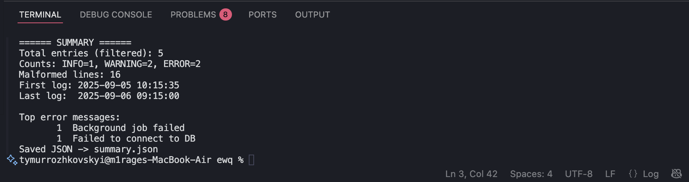
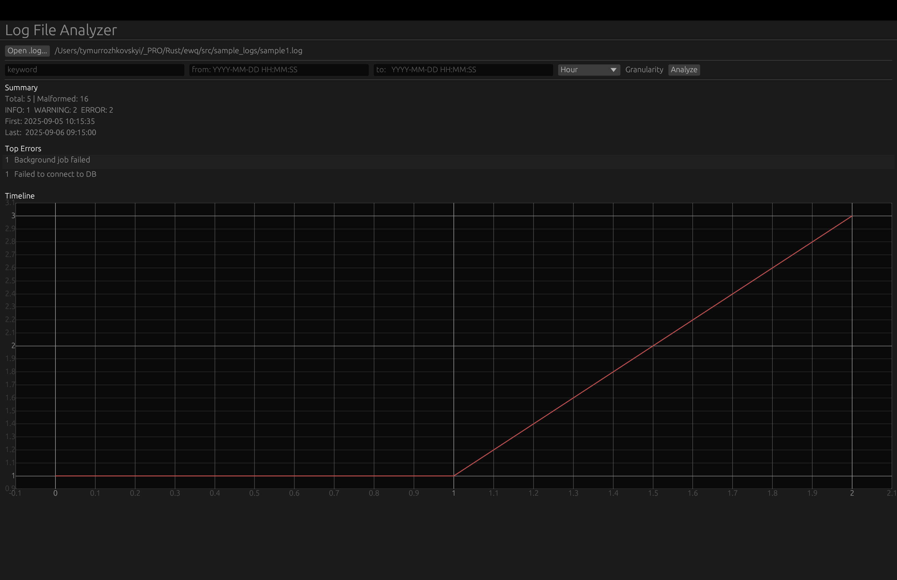
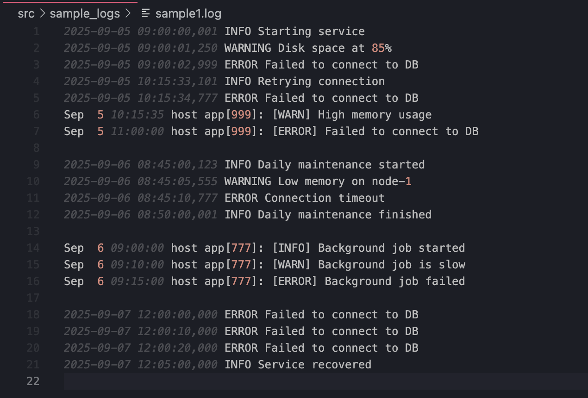
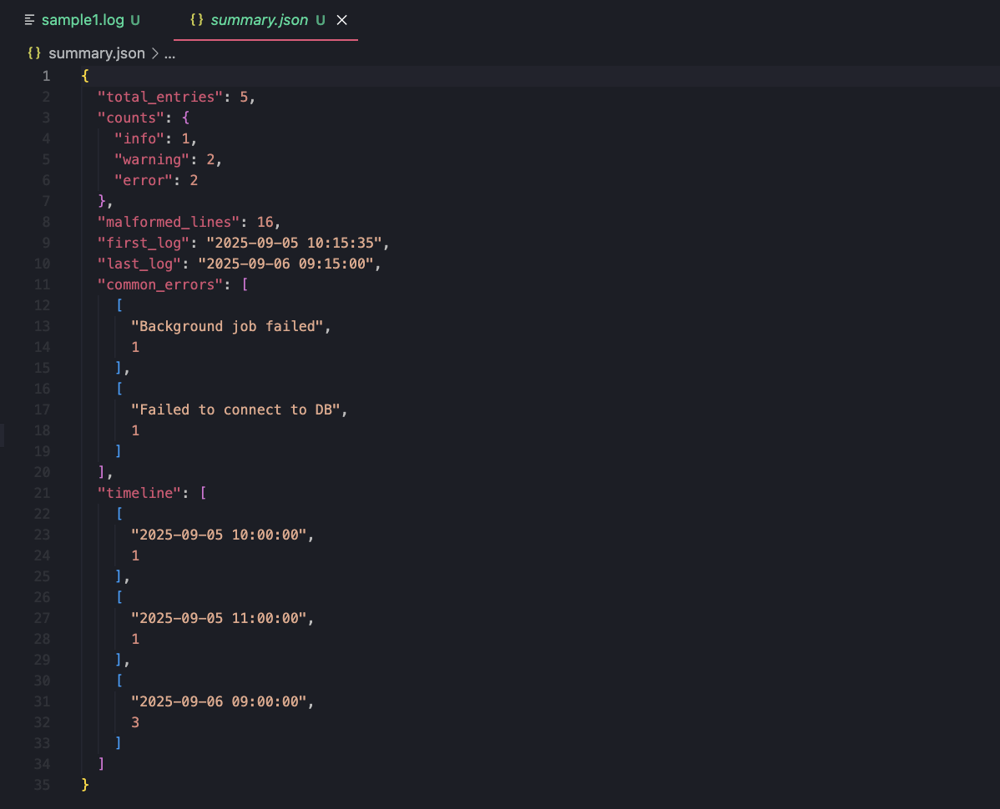

# Log File Analyzer (Rust)

A Rust application for parsing and analyzing .log files.
Supports both CLI (command line interface) and GUI (graphical interface).

## Features

Understands common log formats:

* ISO-like with milliseconds
```
2025-09-05 09:00:00,001 INFO Starting service
```

* Syslog-like with [INFO] / [WARN] / [ERROR]
```
Sep 5 10:15:35 host app[999]: [ERROR] Failed to connect to DB
```

* Regex-based extraction of timestamps and levels (INFO, WARNING, ERROR).

* Count logs by type and detect malformed lines.
 
* Filtering by keyword, date range, and level.

* Summary report:

* Total entries

* First / Last log timestamp

* Counts by INFO/WARNING/ERROR

* Most common error messages

* Export results to JSON.

* Generate visualizations:

* Bar chart (counts per level)

* Timeline chart (log frequency over time)

* CLI for automation and scripting.

* GUI for interactive exploration of log files.

## Installation & Build

```bash
git clone https://github.com/your-username/log-analyzer-rust.git

cd log-analyzer-rust

build CLI only

cargo build --release --no-default-features --features cli

build with GUI

cargo build --release --features gui
```

## Usage
#### CLI mode

```bash

Show help

cargo run --release -- --help

Analyze a single file and save JSON + charts

cargo run --release -- logs/app.log
--json-out summary.json
--bar-out bar.png
--timeline-out timeline.png
```

#### GUI mode

```bash
cargo run --release --features gui -- --gui
```

## Sample Logs

```
2025-09-05 09:00:00,001 INFO Starting service
2025-09-05 09:00:01,250 WARNING Disk space at 85%
2025-09-05 09:00:02,999 ERROR Failed to connect to DB
2025-09-05 10:15:33,101 INFO Retrying connection
2025-09-05 10:15:34,777 ERROR Failed to connect to DB
Sep 5 10:15:35 host app[999]: [WARN] High memory usage
Sep 5 11:00:00 host app[999]: [ERROR] Failed to connect to DB
```

## JSON Output Example

```json
{
"total_entries": 7,
"malformed_lines": 0,
"counts": {
"info": 2,
"warning": 2,
"error": 3
},
"first_log": "2025-09-05 09:00:00",
"last_log": "2025-09-05 11:00:00",
"common_errors": {
"Failed to connect to DB": 3
},
"timeline": [
["2025-09-05 09:00:00", 3],
["2025-09-05 10:15:00", 2],
["2025-09-05 11:00:00", 1]
]
}
```

## Screenshots

### 1. CLI run – analyzing logs in terminal


### 2. GUI app – interactive log explorer


### 3. Log file – example sample1.log content


### 4. JSON output – saved summary results

